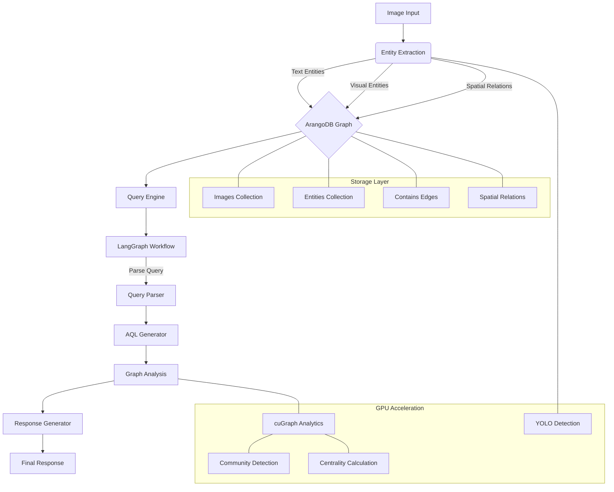

# GraphRAG Technical Architecture

## Overview

This document outlines the technical architecture for a GPU-accelerated GraphRAG system designed for image content analysis. The system leverages graph databases for storing entities and relationships extracted from images, with GPU acceleration for performance-critical components. It follows a pipeline architecture with modular components for entity extraction, graph construction, query processing, and result generation.

## Technology Stack

- **Graph Database**: ArangoDB
- **GPU Acceleration**: NVIDIA cuGraph, CUDA
- **CPU Fallback**: NetworkX
- **ML Framework**: PyTorch, YOLO
- **OCR Engine**: Tesseract with GPU acceleration
- **NLP Processing**: SpaCy (Transformer models)
- **RAG Framework**: LangChain, LangGraph
- **Container Orchestration**: Docker with NVIDIA Container Runtime

## Core Modules

### 1. Entity Extraction Module

```python
# src/extraction/image_processor.py
class ImageProcessor:
    def __init__(self, config: ProcessorConfig):
        self.ocr_engine = self._init_ocr_engine(config.ocr_config)
        self.object_detector = YOLO(config.yolo_model_path)
        self.nlp = spacy.load(config.spacy_model)
        self.gpu_available = torch.cuda.is_available()
        
    def process_image(self, image_path: str) -> ImageEntities:
        """Process an image to extract both textual and visual entities."""
        # GPU-accelerated image preprocessing
        img = self._preprocess_image(image_path)
        
        # Extract text via OCR
        text_entities = self._extract_text_entities(img)
        
        # Extract visual objects
        visual_entities = self._detect_visual_entities(img)
        
        # Analyze spatial relationships
        spatial_relations = self._analyze_spatial_relations(visual_entities)
        
        return ImageEntities(
            text_entities=text_entities,
            visual_entities=visual_entities,
            spatial_relations=spatial_relations,
            source=image_path
        )
```

### 2. ArangoDB Graph Module

```python
# src/graph/arango_manager.py
class ArangoGraphManager:
    def __init__(self, connection_config: ArangoConfig):
        self.client = ArangoClient(hosts=connection_config.host)
        self.db = self.client.db(
            connection_config.database,
            username=connection_config.username,
            password=connection_config.password
        )
        self._init_collections()
        self._init_indexes()
        self._init_views()
        
    def _init_collections(self):
        """Initialize required collections if they don't exist."""
        if not self.db.has_collection("images"):
            self.db.create_collection("images")
        
        if not self.db.has_collection("entities"):
            self.db.create_collection("entities")
            
        if not self.db.has_collection("contains"):
            self.db.create_collection("contains", edge=True)
            
        if not self.db.has_collection("spatial_relation"):
            self.db.create_collection("spatial_relation", edge=True)
    
    def insert_entities(self, image_id: str, entities: ImageEntities):
        """Insert entities and relationships into the graph database."""
        # Implementation details for batch insertion
        # with optimized ArangoDB operations
```

### 3. GPU-Accelerated Graph Analytics

```python
# src/analytics/cugraph_analyzer.py
class CuGraphAnalyzer:
    def __init__(self, config: AnalyticsConfig):
        self.config = config
        self.resource_handle = ResourceHandle(
            memory_limit=config.gpu_memory_limit,
            temporary_data_directory=config.temp_dir
        )
    
    def analyze_communities(self, graph_data: GraphData) -> CommunityAnalysis:
        """Perform community detection using GPU acceleration."""
        G = self._convert_to_cugraph(graph_data)
        
        # Use Leiden algorithm for community detection
        partitions = leiden(G, resolution=self.config.resolution)
        
        return CommunityAnalysis(
            communities=partitions.to_pandas(),
            metrics=self._calculate_metrics(G, partitions)
        )
        
    def calculate_centrality(self, graph_data: GraphData) -> CentralityScores:
        """Calculate node centrality metrics using GPU acceleration."""
        G = self._convert_to_cugraph(graph_data)
        
        # Calculate pagerank
        pr_scores = pagerank(G)
        
        # Calculate betweenness centrality
        bc_scores = betweenness_centrality(G)
        
        return CentralityScores(
            pagerank=pr_scores.to_pandas(),
            betweenness=bc_scores.to_pandas()
        )
```

### 4. GraphRAG Query Engine

```python
# src/rag/query_engine.py
class GraphRAGQueryEngine:
    def __init__(self, 
                 db_manager: ArangoGraphManager,
                 graph_analyzer: GraphAnalyzer,
                 llm_chain: LLMChain,
                 config: QueryConfig):
        self.db_manager = db_manager
        self.graph_analyzer = graph_analyzer
        self.llm_chain = llm_chain
        self.config = config
        self.workflow = self._build_query_workflow()
        
    def _build_query_workflow(self) -> MessageGraph:
        """Build the LangGraph workflow for query processing."""
        workflow = MessageGraph()
        
        # Add nodes to the workflow
        workflow.add_node("parse_query", self._parse_query)
        workflow.add_node("aql_generation", self._generate_aql)
        workflow.add_node("graph_analysis", self._run_graph_analysis)
        workflow.add_node("generate_response", self._generate_response)
        
        # Define edges
        workflow.add_edge("parse_query", "aql_generation")
        workflow.add_edge("aql_generation", "graph_analysis")
        workflow.add_edge("graph_analysis", "generate_response")
        
        return workflow
        
    def execute_query(self, query: str) -> QueryResult:
        """Execute a natural language query against the graph database."""
        # Execute the workflow
        result = self.workflow.execute({"query": query})
        return result["response"]
```

## Database Schema

### ArangoDB Collections

```javascript
// Database schema in ArangoDB JavaScript syntax

// Images Collection
db._createDocumentCollection("images");
db.images.ensureIndex({ type: "persistent", fields: ["url"], unique: true });

// Entities Collection
db._createDocumentCollection("entities");
db.entities.ensureIndex({ type: "persistent", fields: ["type"] });
db.entities.ensureIndex({ type: "persistent", fields: ["text"] });

// Contains Edge Collection (image-to-entity)
db._createEdgeCollection("contains");
db.contains.ensureIndex({ type: "persistent", fields: ["_from", "_to"] });

// Spatial Relation Edge Collection
db._createEdgeCollection("spatial_relation");
db.spatial_relation.ensureIndex({ type: "persistent", fields: ["_from", "_to"] });
db.spatial_relation.ensureIndex({ type: "persistent", fields: ["relation_type"] });

// ArangoSearch View for text search
db._createView("entities_view", "arangosearch", {
  links: {
    entities: {
      includeAllFields: false,
      fields: {
        text: { analyzers: ["text_en"] }
      }
    }
  }
});
```

## Architecture Diagram



## Event-Driven Components

### Processing Pipeline Events

```python
# src/events/event_types.py
class ImageProcessingEvent:
    def __init__(self, image_id: str, image_path: str, batch_id: str):
        self.image_id = image_id
        self.image_path = image_path
        self.batch_id = batch_id
        self.timestamp = datetime.now().isoformat()

class GraphUpdateEvent:
    def __init__(self, entity_ids: List[str], update_type: str):
        self.entity_ids = entity_ids
        self.update_type = update_type
        self.timestamp = datetime.now().isoformat()

# src/events/event_handler.py
class EventHandler:
    def __init__(self, 
                 image_processor: ImageProcessor,
                 graph_manager: ArangoGraphManager):
        self.image_processor = image_processor
        self.graph_manager = graph_manager
        
    def handle_image_processing(self, event: ImageProcessingEvent):
        """Process an image and update the graph database."""
        # Extract entities from the image
        entities = self.image_processor.process_image(event.image_path)
        
        # Insert entities into the graph database
        self.graph_manager.insert_entities(event.image_id, entities)
        
        # Emit a graph update event
        return GraphUpdateEvent(
            entity_ids=[e.id for e in entities.all_entities()],
            update_type="image_processed"
        )
```

## Performance Optimization

### cuGraph Memory Management

```python
# src/config/resource_config.py
class GPUResourceConfig:
    def __init__(self,
                 memory_limit: float = 0.8,
                 temp_dir: str = "/tmp/gpu_cache",
                 enable_profiling: bool = False):
        self.memory_limit = memory_limit
        self.temp_dir = temp_dir
        self.enable_profiling = enable_profiling

# src/analytics/resource_manager.py
class GPUResourceManager:
    def __init__(self, config: GPUResourceConfig):
        self.config = config
        self.handle = ResourceHandle(
            memory_limit=config.memory_limit,
            temporary_data_directory=config.temp_dir
        )
        self.profiler = None
        if config.enable_profiling:
            self.profiler = GPUProfiler()
    
    def __enter__(self):
        if self.profiler:
            self.profiler.start()
        return self.handle
    
    def __exit__(self, exc_type, exc_val, exc_tb):
        if self.profiler:
            metrics = self.profiler.stop()
            logging.info(f"GPU Metrics: {metrics}")
```

### ArangoDB Optimization

```python
# src/graph/optimized_queries.py
class OptimizedQueries:
    """Collection of optimized AQL queries for GraphRAG operations."""
    
    @staticmethod
    def entity_neighborhood(entity_id: str, max_depth: int = 2) -> str:
        """Get the neighborhood of an entity with optimized traversal."""
        return f"""
        FOR v, e, p IN 1..{max_depth} 
            ANY 'entities/{entity_id}' 
            GRAPH 'entity_graph'
            OPTIONS {{bfs: true, uniqueVertices: 'global'}}
            RETURN {{
                vertex: v,
                edge: e,
                path: p
            }}
        """
    
    @staticmethod
    def community_query(community_id: int, limit: int = 100) -> str:
        """Get entities belonging to a specific community."""
        return f"""
        FOR e IN entities
            FILTER e.community == {community_id}
            SORT e.centrality DESC
            LIMIT {limit}
            RETURN e
        """
```

## Security Implementations

### Authentication and Authorization

```python
# src/auth/auth_manager.py
class AuthManager:
    def __init__(self, config: AuthConfig):
        self.secret_key = config.secret_key
        self.token_expiration = config.token_expiration
        
    def generate_token(self, user_id: str, scopes: List[str]) -> str:
        """Generate a JWT token with specified scopes."""
        payload = {
            'sub': user_id,
            'scopes': scopes,
            'exp': datetime.utcnow() + timedelta(seconds=self.token_expiration)
        }
        return jwt.encode(payload, self.secret_key, algorithm='HS256')
        
    def validate_token(self, token: str) -> Dict:
        """Validate a JWT token and return the payload."""
        try:
            payload = jwt.decode(token, self.secret_key, algorithms=['HS256'])
            return payload
        except jwt.ExpiredSignatureError:
            raise AuthenticationError("Token expired")
        except jwt.InvalidTokenError:
            raise AuthenticationError("Invalid token")
```

## Deployment Architecture

### Docker Configuration

```dockerfile
# Dockerfile
FROM nvidia/cuda:12.0.0-devel-ubuntu22.04

# Set up environment
ENV PYTHONUNBUFFERED=1 \
    PYTHONDONTWRITEBYTECODE=1 \
    PIP_NO_CACHE_DIR=1 \
    DEBIAN_FRONTEND=noninteractive

# Install system dependencies
RUN apt-get update && apt-get install -y \
    python3-pip python3-dev \
    libpq-dev build-essential \
    tesseract-ocr libtesseract-dev \
    && rm -rf /var/lib/apt/lists/*

WORKDIR /app

# Install Python dependencies
COPY requirements.txt .
RUN pip3 install --no-cache-dir -r requirements.txt

# Copy application code
COPY . .

# Expose ports
EXPOSE 8000

# Set entrypoint
CMD ["python3", "-m", "src.main"]
```

### Docker Compose Setup

```yaml
# docker-compose.yml
version: '3.8'

services:
  graphrag-api:
    build: .
    ports:
      - "8000:8000"
    volumes:
      - ./data:/app/data
      - ./config:/app/config
    environment:
      - ARANGO_HOST=http://arangodb:8529
      - ARANGO_DB=graphrag
      - ARANGO_USER=${ARANGO_USER}
      - ARANGO_PASSWORD=${ARANGO_PASSWORD}
      - GPU_MEMORY_LIMIT=0.7
    deploy:
      resources:
        reservations:
          devices:
            - driver: nvidia
              count: 1
              capabilities: [gpu]
    depends_on:
      - arangodb

  arangodb:
    image: arangodb:latest
    ports:
      - "8529:8529"
    environment:
      - ARANGO_ROOT_PASSWORD=${ARANGO_PASSWORD}
    volumes:
      - arango-data:/var/lib/arangodb3

volumes:
  arango-data:
```

## Benchmarking and Evaluation

### Performance Metrics

```python
# src/evaluation/benchmark.py
class GraphRAGBenchmark:
    def __init__(self, query_engine: GraphRAGQueryEngine, test_set: List[QueryTestCase]):
        self.query_engine = query_engine
        self.test_set = test_set
        
    def run_benchmarks(self) -> BenchmarkResults:
        """Run benchmarks on the GraphRAG system."""
        results = []
        
        for test_case in self.test_set:
            # Measure query execution time
            start_time = time.time()
            response = self.query_engine.execute_query(test_case.query)
            execution_time = time.time() - start_time
            
            # Calculate precision and recall
            precision = self._calculate_precision(response, test_case.expected)
            recall = self._calculate_recall(response, test_case.expected)
            
            # Record GPU memory usage
            gpu_metrics = self._get_gpu_metrics()
            
            results.append(QueryResult(
                query=test_case.query,
                execution_time=execution_time,
                precision=precision,
                recall=recall,
                gpu_metrics=gpu_metrics
            ))
            
        return BenchmarkResults(results=results)
```

## Scaling Considerations

1. **Horizontal Scaling**
   - Distribute image processing across multiple GPU nodes
   - Use ArangoDB SmartGraphs for sharded graph storage
   - Implement load balancing for query processing

2. **Performance Optimization**
   - Use batched processing for entity extraction
   - Implement caching for frequently accessed graph patterns
   - Optimize AQL queries with proper indexes

3. **GPU Resource Management**
   - Implement dynamic GPU memory allocation
   - Use streaming for large dataset processing
   - Provide CPU fallback for non-performance-critical operations

## Development Workflow

1. **Local Development**
   ```bash
   # Start development environment with GPU support
   docker-compose -f docker-compose.dev.yml up
   
   # Run benchmarks
   python -m src.evaluation.run_benchmarks
   
   # Process a batch of images
   python -m src.tools.batch_processor --input-dir ./data/images --batch-size 32
   ```

2. **Testing Strategy**
   ```python
   # src/tests/test_entity_extraction.py
   def test_image_entity_extraction():
       """Test that entities are correctly extracted from test images."""
       config = ProcessorConfig(
           ocr_config=OCRConfig(engine="tesseract", lang="eng"),
           yolo_model_path="yolov8x.pt",
           spacy_model="en_core_web_trf"
       )
       processor = ImageProcessor(config)
       
       # Process a test image
       entities = processor.process_image("src/tests/data/test_image.jpg")
       
       # Verify text entities were extracted
       assert len(entities.text_entities) > 0
       
       # Verify visual entities were detected
       assert len(entities.visual_entities) > 0
       
       # Verify spatial relations were analyzed
       assert len(entities.spatial_relations) > 0
   ```

## Future Considerations

1. **Advanced Graph Analytics**
   - Implement temporal graph analysis for sequence detection
   - Add multi-modal embedding fusion
   - Explore graph neural networks for entity classification

2. **Distributed Computing**
   - Implement distributed processing with Dask
   - Add support for multi-GPU environments
   - Design pipeline for very large graph processing

3. **User Experience**
   - Develop interactive graph visualization tools
   - Create natural language interface for complex graph queries
   - Design explainable AI components for graph reasoning